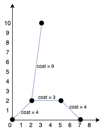

# 1584 连接所有点的最小费用
## 链接
https://leetcode.cn/problems/min-cost-to-connect-all-points/description/

## 题目 
给你一个points 数组，表示 2D 平面上的一些点，其中 points[i] = [xi, yi] 。

连接点 [xi, yi] 和点 [xj, yj] 的费用为它们之间的 曼哈顿距离 ：|xi - xj| + |yi - yj| ，其中 |val| 表示 val 的绝对值。

请你返回将所有点连接的最小总费用。只有任意两点之间 有且仅有 一条简单路径时，才认为所有点都已连接。

## 示例
示例 1:


```
输入：points = [[0,0],[2,2],[3,10],[5,2],[7,0]]
输出：20

我们可以按照下图所示连接所有点得到最小总费用，总费用为 20 。
注意到任意两个点之间只有唯一一条路径互相到达。
```


示例 2:
```
输入：points = [[3,12],[-2,5],[-4,1]]
输出：18
```
示例 3:
```
输入：points = [[0,0],[1,1],[1,0],[-1,1]]
输出：4
```
示例 4:
```
输入：points = [[-1000000,-1000000],[1000000,1000000]]
输出：4000000
```
示例 5:
```
输入：points = [[0,0]]
输出：0
```

提示：

- 1 <= points.length <= 1000
- -1e6 <= xi, yi <= 1e6
- 所有点 (xi, yi) 两两不同。

## 代码
思路:

最小生成树, Kruskal算法
- 已知所有边的权重, 按从小到大排序
- 若改变的两点不连通, 则将其连通, 选择该边
- 直到选择的边的个数 = 点个数 - 1

判断连通, 使用并查集

```
#include <iostream>
#include <vector>
#include <queue>
#include <algorithm>
using namespace std; 

struct Edge {
	int p1;
	int p2;
	int len;
	Edge() : p1(-1), p2(-1), len(-1) {}
	Edge(int p1, int p2, int len) : p1(p1), p2(p2), len(len) {}
	bool operator < (const Edge& other) const {
		return this->len > other.len;
	}
};

class Solution {
public:
	vector<int> father = vector<int>(1010, 0);
	
	void init(int n) {
		for (int i = 0; i < n; i++) 
			father[i] = i;
	}
	
	int find(int u) {
		return u == father[u] ? u : father[u] = find(father[u]);
	}
	
	void join(int u, int v) {
		u = find(u);
		v = find(v);
		if (u != v)
			father[u] = v;
	}
	
	bool isSame(int u, int v) {
		u = find(u);
		v = find(v);
		return u == v;
	}
	
	int minCostConnectPoints(vector<vector<int>>& points) {
		int n = points.size();
		if (n < 2) return 0;
		priority_queue<Edge> edges;
		for (int i = 0; i < n; i++) {
			for (int j = i + 1; j < n; j++) {
				edges.push(Edge(i, j, abs(points[i][0] - points[j][0]) + abs(points[i][1] - points[j][1])));
			}
		}
		init(n);
		Edge t;
		int sum = 0;
		while (!edges.empty()) {
			t = edges.top();
			edges.pop();
			if (!isSame(t.p1, t.p2)) {
				sum += t.len;
				join(t.p1, t.p2);
			}
		}
		return sum;
    }
};

int main () {
	Solution solution;
	vector<vector<int>> points = { {3, 12}, {-2, 5}, {-4, 1} };
	cout << solution.minCostConnectPoints(points) << endl;
	return 0;
}
```