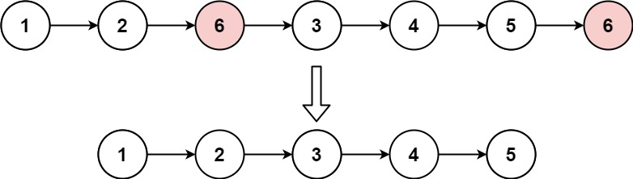

# 203 移除链表元素
## 链接
https://leetcode.cn/problems/remove-linked-list-elements/description/

## 题目 
给你一个链表的头节点 head 和一个整数 val ，请你删除链表中所有满足 Node.val == val 的节点，并返回 新的头节点 。

## 示例
示例 1:


```
输入：head = [1,2,6,3,4,5,6], val = 6
输出：[1,2,3,4,5]
```
示例 2:
```
输入：head = [], val = 1
输出：[]
```
示例 3:
```
输入：head = [7,7,7,7], val = 7
输出：[]
```
提示：

- 列表中的节点数目在范围 [0, 10e4] 内
- 1 <= Node.val <= 50
- 0 <= val <= 50

## 代码
思路:

链表的题, 推荐全都加一个虚拟头结点, 这样增删就可以保持一致。

通过定义一个迭代指针it, 从虚拟节点开始向后遍历。

若it的下一个节点为空, 即为遍历完成, 结束。

若it的下一个节点不为空, 判断下一个节点的值是否和val相等, 相等就删除; 反之则it后移。

最后返回的结果是虚拟节点的下一个节点!!

```
#include<iostream>
#include<vector>
using namespace std;

struct ListNode{
	int val;
	ListNode* next;
	ListNode(int x): val(x), next(nullptr) {}
	ListNode(int x, ListNode* next): val(x), next(next) {}
};

class Solution {
public:
    ListNode* removeElements(ListNode* head, int val) {
		ListNode* virtualHead = new ListNode(0, head);
		ListNode* it = virtualHead;
		while(it->next != nullptr){
			ListNode* temp = it->next;
			if(temp->val == val){
				it->next = temp->next;
				delete temp;
			}else{
				it = it->next;
			}
		}
		return virtualHead->next;
    }
};
int main(){
	Solution *s = new Solution();
	ListNode* head = new ListNode(1, 
						new ListNode(2,
							new ListNode(6,
								new ListNode(3,
									new ListNode(4,
										new ListNode(5,
											new ListNode(6)))))));
	int val = 6;
	auto index = s->removeElements(head, val);
	int a = 0;
//	cout << index;
}
```