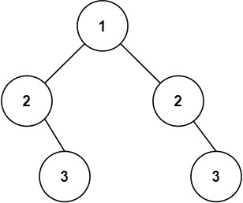

# 101 对称二叉树
## 链接
https://leetcode.cn/problems/symmetric-tree/description/

## 题目 
给你一个二叉树的根节点 root ， 检查它是否轴对称。

## 示例
示例 1:


```
输入：root = [1,2,2,3,4,4,3]
输出：true
```
示例 2:


```
输入：root = [1,2,2,null,3,null,3]
输出：false
```

提示：

- 树中节点数目在范围 [1, 1000] 内
- -100 <= Node.val <= 100

## 代码
思路: 迭代

只有根节点是一个, 因此先处理根节点

将根节点的左右孩子放到队列中

每次从队列取出两个节点进行判断, 然后将第一个节点的左节点和第二个节点的右节点入队, 再将第一个节点的右节点和第二个节点的左节点入队, 直到不等或者队列为空

```
#include<vector>
#include<algorithm>
#include<deque>
using namespace std;

struct TreeNode {
    int val;
    TreeNode *left;
    TreeNode *right;
    
    TreeNode() : val(0), left(nullptr), right(nullptr) {}
    TreeNode(int val) : val(val), left(nullptr), right(nullptr) {}
    TreeNode(int val, TreeNode* left, TreeNode* right) : val(val), left(left), right(right) {}
};
    
class Solution {
public:
    deque<TreeNode*> dq;
    
    bool push_dq(TreeNode* left, TreeNode* right) {
        if (left != nullptr && right != nullptr) {
            dq.push_back(left);
            dq.push_back(right);
        } else if (left == nullptr && right == nullptr) {
            
        } else
            return false;
        return true;
    }
    
    bool isSymmetric(TreeNode* root) {  
        if (root->left == nullptr && root->right == nullptr) return true;
        if (root->left == nullptr) return false;
        if (root->right == nullptr) return false;
    
        dq.push_back(root->left);
        dq.push_back(root->right);
        while (!dq.empty()) {
            auto left = dq.front();
            dq.pop_front();
            auto right = dq.front();
            dq.pop_front();
            if (left->val != right->val)
                return false;
            if (push_dq(left->left, right->right) == false)
                return false;
            if (push_dq(left->right, right->left) == false)
                return false;
        }
        return true;
    }
};

int main() {
    Solution solution;
    TreeNode* root = new TreeNode(1, 
                        new TreeNode(2,
                            nullptr,
                            new TreeNode(3)),
                        new TreeNode(2,
                            nullptr,
                            new TreeNode(3)));
    auto res = solution.isSymmetric(root);
    return 0;
}
```