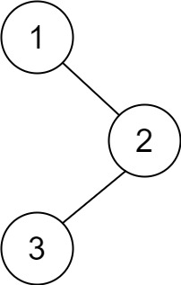

# 145 二叉树的后序遍历
## 链接
https://leetcode.cn/problems/binary-tree-postorder-traversal/description/

## 题目 
给你一棵二叉树的根节点 root ，返回其节点值的 后序遍历 。

## 示例
示例 1:


```
输入：root = [1,null,2,3]
输出：[3,2,1]
```
示例 2:
```
输入：root = []
输出：[]
```
示例 3:
```
输入：root = [1]
输出：[1]
```

提示：

- 树中节点的数目在范围 [0, 100] 内
- -100 <= Node.val <= 100

## 代码
思路: 递归
- 确定递归的终止条件: 当前节点为空
- 确定返回值: 无, 定义了全局res
- 确定参数: 递归中需要使用/处理的, 左, 右, 赋值

```
#include<vector>
using namespace std;

struct TreeNode {
	int val;
	TreeNode *left;
	TreeNode *right;
	TreeNode() : val(0), left(nullptr), right(nullptr) {}
	TreeNode(int val) : val(val), left(nullptr), right(nullptr) {}
	TreeNode(int val, TreeNode *left, TreeNode *right) : val(val), left(left), right(right) {}
};
	
class Solution {
public:
	vector<int> res = vector<int>(110);
	int idx = 0;
	
	void leftRightRoot(TreeNode* node) {
		if (node == nullptr) return;
		
		leftRightRoot(node->left);
		leftRightRoot(node->right);
		res[idx++] = node->val;
	}
	
    vector<int> postorderTraversal(TreeNode* root) {
		leftRightRoot(root);
		return vector<int>(res.begin(), res.begin()+idx);
    }
};

int main() {
	Solution solution;
	TreeNode *root = new TreeNode(1, 
					    nullptr, 
						new TreeNode(2, 
							new TreeNode(3), 
							nullptr));
	auto res = solution.postorderTraversal(root);
	return 0;
}
```

思路: 迭代

使用栈来保存 节点信息 以及 状态(是否被遍历过)
- 先将(root, false)入栈
- 当栈不为空的时候, 取出栈顶元素的指针back(取指针才能修改状态)
- 若back的状态为false, 则表明其还未放入res中, 将其右孩子放入栈中(不为空的话), 左孩子放入栈中(不为空的话), 并将状态改为true
- 若back的状态为true, 则表明其左右孩子全部已经放入到res中, 因此将其val放入到res中, 并将该节点出栈
- 直到栈空

```
#include<vector>
#include<deque>
using namespace std;

struct TreeNode {
	int val;
	TreeNode *left;
	TreeNode *right;
	TreeNode() : val(0), left(nullptr), right(nullptr) {}
	TreeNode(int val) : val(val), left(nullptr), right(nullptr) {}
	TreeNode(int val, TreeNode *left, TreeNode *right) : val(val), left(left), right(right) {}
};
	
class Solution {
public:
	deque<pair<TreeNode*, bool>> dq;
	vector<int> res = vector<int>(110);
	int idx = 0;
	
    vector<int> postorderTraversal(TreeNode* root) {
		if(root == nullptr) return vector<int>();
		
		dq.push_back(make_pair(root, false));
		while(!dq.empty()) {
			auto back = dq.end()-1;
			if(back->second) {
				res[idx++] = back->first->val;
				dq.pop_back();
			} else {
				back->second = true;
				if (back->first->right != nullptr)
					dq.push_back(make_pair(back->first->right, false));
				if (back->first->left != nullptr)
					dq.push_back(make_pair(back->first->left, false));
			}
		}
		return vector<int>(res.begin(), res.begin()+idx);
    }
};

int main() {
	Solution solution;
	TreeNode *root = new TreeNode(1, 
					    nullptr, 
						new TreeNode(2, 
							new TreeNode(3), 
							nullptr));
	auto res = solution.postorderTraversal(root);
	return 0;
}
```