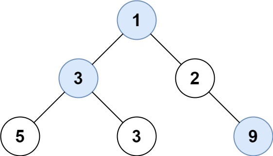

# 515 在每个树行中找最大值
## 链接
https://leetcode.cn/problems/find-largest-value-in-each-tree-row/description/

## 题目 
给定一棵二叉树的根节点 root ，请找出该二叉树中每一层的最大值。

## 示例
示例 1:


```
输入: root = [1,3,2,5,3,null,9]
输出: [1,3,9]
```
示例 2:
```
输入: root = [1,2,3]
输出: [1,3]
```

提示：

- 二叉树的节点个数的范围是 [0,10]
- -2^31 <= Node.val <= 2^31 - 1

## 代码
思路: 迭代

层序变量, 记录最大值

```
#include<vector>
#include<algorithm>
#include<deque>
using namespace std;

struct TreeNode {
	int val;
	TreeNode* left;
	TreeNode* right;
	TreeNode() : val(0), left(nullptr), right(nullptr) {}
	TreeNode(int val) : val(val), left(nullptr), right(nullptr) {}
	TreeNode(int val, TreeNode* left, TreeNode* right) : val(val), left(left), right(right) {}
};
	
class Solution {
public:
	deque<TreeNode*> dq;
	vector<int> res;
	
    vector<int> largestValues(TreeNode* root) {
		if (root == nullptr) return res;
		
		dq.push_back(root);
		while (!dq.empty()) {
			int dqlen = dq.size();
			int layermax = dq.front()->val;
			for (int i = 0; i < dqlen; i++) {
				auto front = dq.front();
				if (front->left != nullptr)
					dq.push_back(front->left);
				if (front->right != nullptr)
					dq.push_back(front->right);
				if (front->val > layermax) 
					layermax = front->val;
				dq.pop_front();
			}
			res.push_back(layermax);
		}
		return res;
    }
};

int main() {
	Solution solution;
	TreeNode* root = new TreeNode(1, 
						new TreeNode(3,
							new TreeNode(5),
							new TreeNode(3)),
						new TreeNode(2,
							nullptr,
							new TreeNode(9)));
	auto res = solution.largestValues(root);
	return 0;
}
```