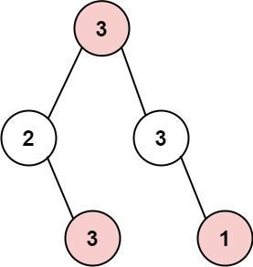

# 337 打家劫舍Ⅲ
## 链接
https://leetcode.cn/problems/house-robber-iii/description/

## 题目 
小偷又发现了一个新的可行窃的地区。这个地区只有一个入口，我们称之为 root 。

除了 root 之外，每栋房子有且只有一个“父“房子与之相连。一番侦察之后，聪明的小偷意识到“这个地方的所有房屋的排列类似于一棵二叉树”。 如果 两个直接相连的房子在同一天晚上被打劫 ，房屋将自动报警。

给定二叉树的 root 。返回 在不触动警报的情况下 ，小偷能够盗取的最高金额 。

## 示例
示例 1:


```
输入: root = [3,2,3,null,3,null,1]
输出: 7 
解释: 小偷一晚能够盗取的最高金额 3 + 3 + 1 = 7
```
示例 2:


```
输入: root = [3,4,5,1,3,null,1]
输出: 9
解释: 小偷一晚能够盗取的最高金额 4 + 5 = 9
```

提示：

- 树的节点数在 [1, 1e4] 范围内
- 0 <= Node.val <= 1e4 

## 代码
思路:

每个节点记录两个数值, 选该节点的最大金额, 不选该节点的最大金额, 然后递归到根节点, 取最大值
- 选该节点的最大金额, 那么一定不能选左右孩子, 因此计算 该节点金额+不选左孩子金额+不选右孩子金额
- 不选该节点的最大金额, 那么左右孩子可以选也可以不选, 因此需要选取孩子节点最大金额即可, 即max(选左孩子, 不选左孩子)+max(选右孩子， 不选右孩子)

```
#include <iostream>
#include <string>
#include <algorithm>
#include <vector>
using namespace std;

struct TreeNode {
	int val;
	TreeNode* left;
	TreeNode* right;
	TreeNode(int x) : val(x), left(nullptr), right(nullptr) {}
	TreeNode(int x, TreeNode* left, TreeNode* right) : val(x), left(left), right(right) {}
};
 
class Solution {
public:
	vector<int> back(TreeNode* node) {
		if (node == nullptr) return vector<int>(2, 0);
		vector<int> left = back(node->left);
		vector<int> right = back(node->right);
		int s1 = max(left[0], left[1]) + max(right[0], right[1]);
		int s2 = left[1] + right[1] + node->val;
		return vector<int>{s2, s1};
	}
	
    int rob(TreeNode* root) {
		auto res = back(root);
		return max(res[0], res[1]);
    }
};

int main() {
	Solution solution;
	vector<int> nums = {1,2,3,1};
	auto res = solution.rob(nums);
	return 0;
}
```