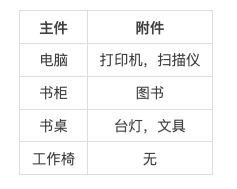

# HJ16 购物单
## 链接
https://www.nowcoder.com/practice/f9c6f980eeec43ef85be20755ddbeaf4?tpId=37

## 题目 
王强决定把年终奖用于购物，他把想买的物品分为两类：主件与附件，附件是从属于某个主件的，下表就是一些主件与附件的例子：



如果要买归类为附件的物品，必须先买该附件所属的主件，且每件物品只能购买一次。
每个主件可以有 0 个、 1 个或 2 个附件。附件不再有从属于自己的附件。
王强查到了每件物品的价格（都是 10 元的整数倍），而他只有 N 元的预算。除此之外，他给每件物品规定了一个重要度，用整数 1 ~ 5 表示。他希望在花费不超过 N 元的前提下，使自己的满意度达到最大。
满意度是指所购买的每件物品的价格与重要度的乘积的总和，假设设第 i 件物品的价格为 v[i]，重要度为 w[i]，共选中了 k 件物品，编号依次为 j_1, ..., j_k ，则满意度为：v[j_1] * w[j_1] + ... + v[j_k] * w[j_k]（其中 * 为乘号）

请你帮助王强计算可获得的最大的满意度。

## 输入描述
输入的第 1 行，为两个正整数N，m，用一个空格隔开：

（其中 N （ N<32000 ）表示总钱数， m （m <60 ）为可购买的物品的个数。）

从第 2 行到第 m+1 行，第 j 行给出了编号为 j-1 的物品的基本数据，每行有 3 个非负整数 v p q

（其中 v 表示该物品的价格（ v<10000 ）， p 表示该物品的重要度（ 1 ~ 5 ）， q 表示该物品是主件还是附件。如果 q=0 ，表示该物品为主件，如果 q>0 ，表示该物品为附件， q 是所属主件的编号）

## 输出描述
输出一个正整数，为张强可以获得的最大的满意度。

## 示例
示例 1:
```
输入：
1000 5
800 2 0
400 5 1
300 5 1
400 3 0
500 2 0

输出：
2200
```
示例 2:
```
输入：
50 5
20 3 5
20 3 5
10 3 0
10 2 0
10 1 0

输出：
130

说明：
由第1行可知总钱数N为50以及希望购买的物品个数m为5；
第2和第3行的q为5，说明它们都是编号为5的物品的附件；
第4~6行的q都为0，说明它们都是主件，它们的编号依次为3~5；
所以物品的价格与重要度乘积的总和的最大值为10*1+20*3+20*3=130   
```

## 代码
```
#include <iostream>
#include <vector>
#include <algorithm>
#define LL long long
using namespace std;

struct Thing {
    LL v[3];
    LL val[3];
    Thing() {
        v[0] = v[1] = v[2] = 0;
        val[0] = val[1] = val[2] = 0;
    };
};

int calc(vector<Thing>& things, int N) {
    LL n = things.size();
    vector<vector<LL>> dp(n + 1, vector<LL>(N + 1, 0));
    for (LL i = 1; i <= n; i++) {
        for (LL j = 1; j <= N; j++) {
            dp[i][j] = max(dp[i][j - 1], dp[i - 1][j]);
            if (j - things[i-1].v[0] >= 0)
                dp[i][j] = max(dp[i][j], dp[i - 1][j - things[i-1].v[0]] + things[i-1].val[0]);
            if (things[i-1].v[1] != 0 && j - things[i-1].v[0] - things[i-1].v[1] >= 0)
                dp[i][j] = max(dp[i][j], dp[i - 1][j - things[i-1].v[0] - things[i-1].v[1]] + things[i-1].val[0] + things[i-1].val[1]);
            if (things[i-1].v[2] != 0 && j - things[i-1].v[0] - things[i-1].v[2] >= 0)
                dp[i][j] = max(dp[i][j], dp[i - 1][j - things[i-1].v[0] - things[i-1].v[2]] + things[i-1].val[0] + things[i-1].val[2]);
            if (things[i-1].v[2] != 0 && things[i-1].v[1] != 0 && j - things[i-1].v[0] - things[i-1].v[2] - things[i - 1].v[1] >= 0)
                dp[i][j] = max(dp[i][j], dp[i - 1][j - things[i-1].v[0] - things[i-1].v[2] - things[i-1].v[1]] + things[i-1].val[0] + things[i-1].val[2] + things[i-1].val[1]);
        }
    }
    return dp[n][N];
}

int main() {
    LL N, m;
    cin >> N >> m;
    vector<Thing> things(m, Thing());
    LL v, p, q;
    for (int i = 0; i < m; i++) {
        cin >> v >> p >> q;
        if (q == 0) {
            things[i].v[0] = v / 10;
            things[i].val[0] = p * v;
        }
        else {
            if (things[q-1].v[1] == 0) {
                things[q-1].v[1] = v / 10;
                things[q-1].val[1] = p * v;
            }
            else {
                things[q-1].v[2] = v / 10;
                things[q-1].val[2] = p * v;
            }
        }
    }
    cout << calc(things, N / 10);
    return 0;
}
// 64 位输出请用 printf("%lld")
```